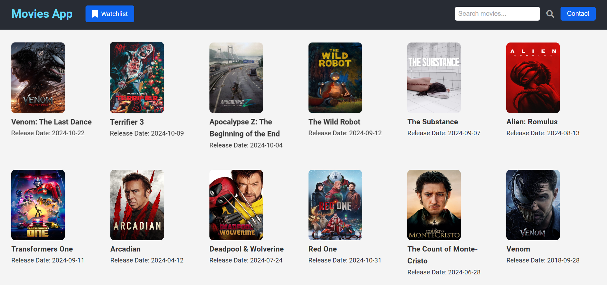
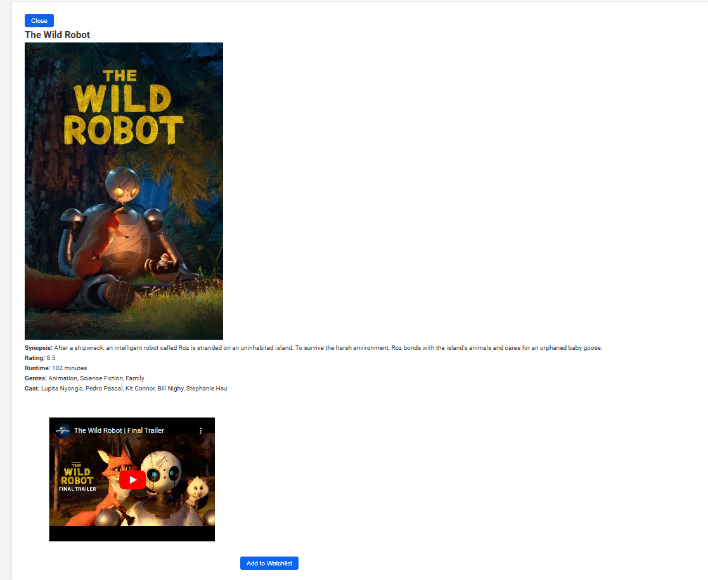
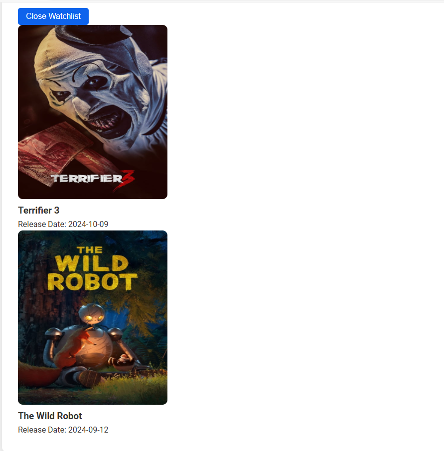
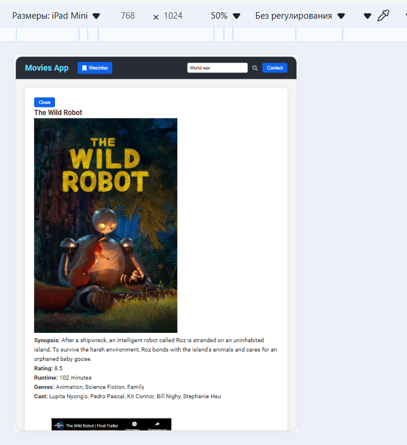
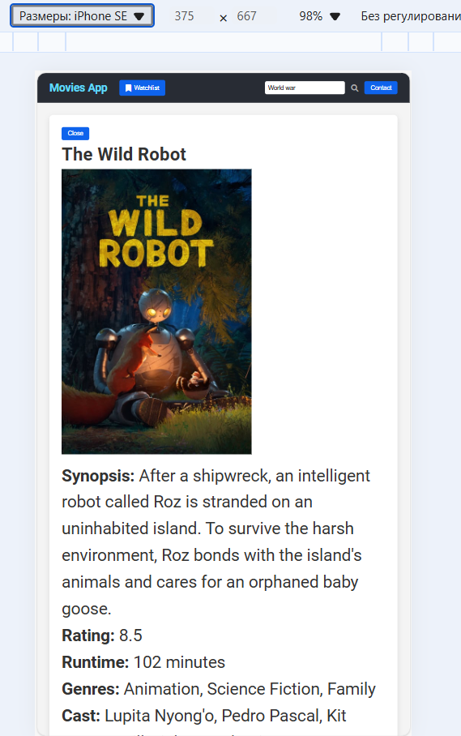

# Movie App

## Description

The Movie App is a web application that allows users to search for movies, view details about them, and save their favorite movies to a watchlist. The app uses The Movie Database (TMDb) API to fetch movie data, including titles, posters, release dates, and detailed information such as genres, cast, and trailers.
## Demonstration
Main page:

Movie Details :

Watchlist:

Responsivness for mobile and tablet devices:

## Features

- **Search Movies:** Users can search for movies by title.
- **View Popular Movies:** The app displays popular movies on the homepage.
- **Movie Details:** Users can view detailed information about a selected movie.
- **Watchlist:** Users can add movies to their watchlist and view them later.

## Instructions to Run the Application

### Prerequisites

- A modern web browser (e.g., Chrome, Firefox, Safari)
- Internet connection

### Steps

1) Just unzip this project and 

Open the index.html file in your web browser. You can do this by double-clicking the file or by using a live server extension in your code editor (e.g., Live Server in VS Code).
Technologies Used
HTML
CSS
JavaScript
TMDb API