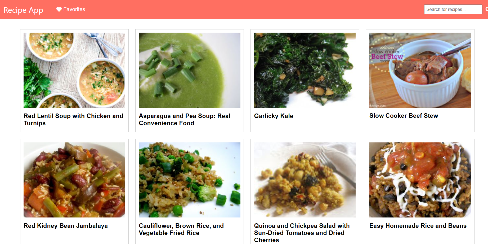
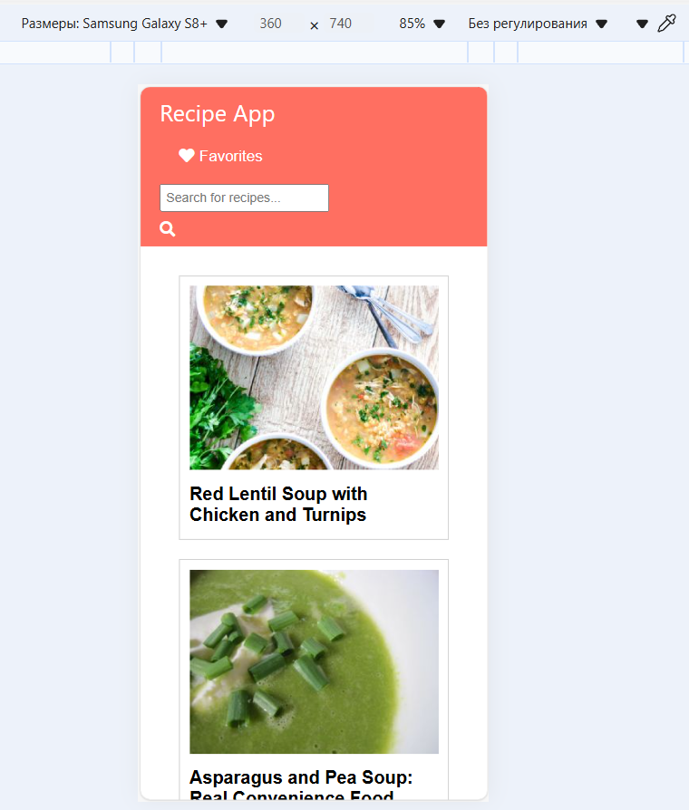
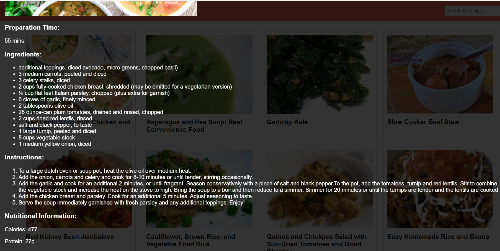
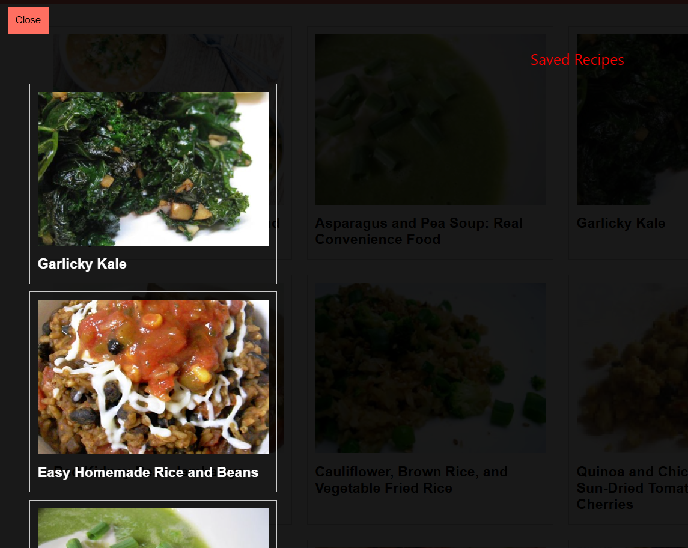

# Recipe App

## Description

The Recipe App allows users to search for recipes by ingredients or dish names. It features an auto-suggest functionality that shows recipe names as the user types. Users can view recipes in a grid layout, see detailed information about each recipe, and save their favorite recipes to a "Favorites" list. The app uses the Spoonacular API to fetch recipe data.
##Demonstration

##Scrrenshots:
Main page (dektop)

main page (mobile)

Recipe Details:

Favorites (Saved recipes to local storage)

### Features

- **Search Functionality**: Users can search for recipes by entering ingredients or dish names. The app provides an auto-suggest feature that shows recipe names as the user types.
- **Display Recipes**: A grid layout showing multiple recipes with images, names, and preparation times. Each recipe card includes a short description.
- **Recipe Details Page**: When a recipe is clicked, it opens a modal displaying ingredients with quantities, step-by-step cooking instructions, nutritional information (calories, protein, fat, etc.), and user ratings and reviews (optional).
- **Favorites Feature**: Users can save recipes to a "Favorites" list for easy access later. The app uses local storage to retain favorite recipes even after refreshing the page.

## Instructions

### Prerequisites

- A modern web browser (e.g., Chrome, Firefox, Edge)

### How to Run the Application

1. **Clone or Download the Repository**: Download the project files to your local machine.

2. **Open the Project Folder**: Navigate to the project folder where the files are located.

3. **Open `index.html`**: Open the `index.html` file in your web browser. You can do this by double-clicking the file or right-clicking and selecting "Open with" followed by your preferred web browser.

4. **Search for Recipes**: Use the search bar at the top to enter ingredients or dish names. The app will display auto-suggestions as you type.

5. **View Recipe Details**: Click on any recipe card to view detailed information about the recipe, including ingredients, instructions, and nutritional information.

6. **Add to Favorites**: Click the "Add to Favorites" button on the recipe details page to save the recipe to your favorites list.

7. **View Favorites**: Click the "Favorites" button in the navigation bar to view your saved recipes.

Local Storage
The app uses local storage to save and retrieve favorite recipes. This ensures that your favorites list is retained even after refreshing the page.